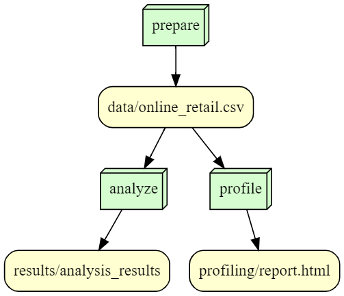

# is477-fall2023-final-project
Simona Merlin - IS 477 Final project

## Overview 

## Workflow

Below is the DAG for the Snakemake workflow:

## Reproducing 

To reproduce the environment and run the script, follow the steps below.

1. Clone this repository

2.  Create a virtual encironement. All of my environment information will be found in the environment.log file

2. Install Dependencies: Make sure you have python and the required libraries installed:
Code: pip install -r requirements.txt

The requrinments.txt contains the basic list of required libraries needed to reproduce.

3. Run the scripts to process and analyze the data
Code: python prepare_data.py 
Code: python profile.py
Code: python analysis.py
Code: python dag.py

4. Expected output:

count    541909.000000
mean          4.611114
std          96.759853
min      -11062.060000
25%           1.250000
50%           2.080000
75%           4.130000
max       38970.000000
Name: UnitPrice, dtype: float64

## License

This project uses the following licenses: 

Moro,S., Rita,P., and Cortez,P.. (2012). Bank Marketing. UCI Machine Learning Repository. https://doi.org/10.24432/C5K306.

@misc{misc_bank_marketing_222,
  author       = {Moro,S., Rita,P., and Cortez,P.},
  title        = {{Bank Marketing}},
  year         = {2012},
  howpublished = {UCI Machine Learning Repository},
  note         = {{DOI}: https://doi.org/10.24432/C5K306}
}

## Refrences